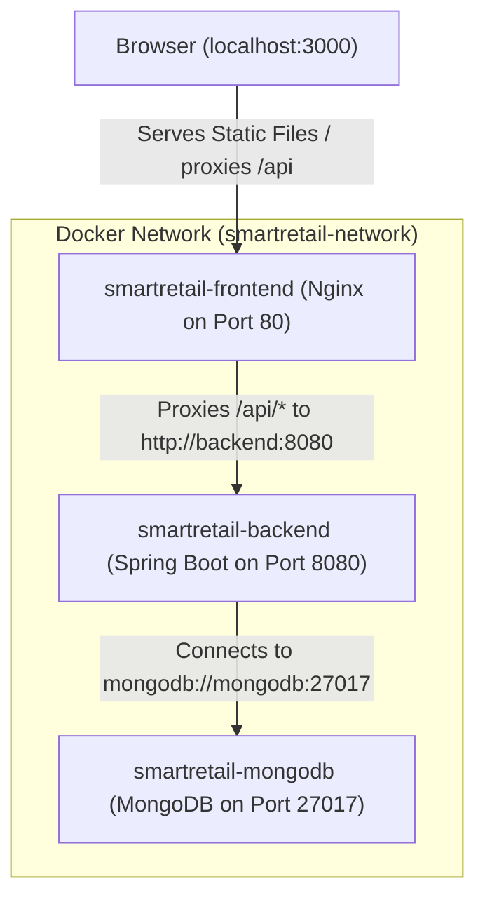
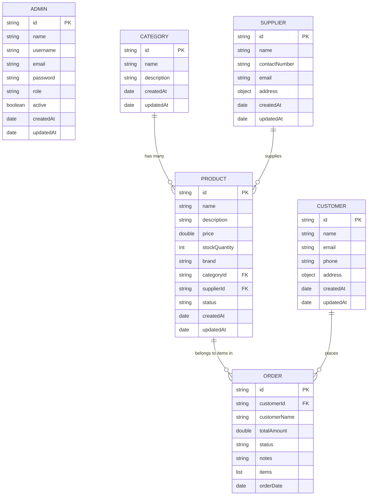

# Smart Retail Operations and Inventory Management System

Enterprise-level Smart Retail Operations and Inventory Management System built with **Spring Boot 3**, **MongoDB**, **React.js**, **Nginx**, and **Docker**.

---

## 🏛️ Project Architecture



*   **Frontend (Nginx)**: Serves static compiled React single-page application (SPA) files and reverse-proxies `/api` calls to the Spring Boot backend container.
*   **Backend (Spring Boot)**: Restful API endpoints secured by stateless JWT authentication and authorization.
*   **Database (MongoDB)**: Scalable document-oriented database with Auditing (auto-timestamps) and unique index creation enabled on startup.

---

## 📊 Database Schema Entity Diagram



---

## 📂 Project Directory Structure

```
SmartRetailSystem/
├── backend/                       ← Java Spring Boot Backend
│   ├── src/                       ← Source files (config, models, controllers, services)
│   ├── Dockerfile                 ← Multi-stage JRE container configuration
│   ├── .dockerignore              ← Build-context excludes
│   └── pom.xml                    ← Maven build file
│
├── frontend/                      ← React + Vite Frontend
│   ├── src/                       ← Components, page routers, UI elements
│   ├── Dockerfile                 ← Multi-stage Node + Nginx container configuration
│   ├── nginx.conf                 ← Nginx reverse proxy configuration
│   ├── .dockerignore              ← Build-context excludes
│   └── package.json               ← NPM packages configuration
│
├── docker-compose.yml             ← Orchestration file for full container stack
└── smart-retail-system.postman_collection.json ← Postman REST API Collection
```

---

## 🚀 Quick Start Instructions

### Prerequisites
- Docker & Docker Compose installed.

### Option A: Run Stack via Docker Compose (Recommended)
To start the entire application stack (database, backend, frontend) with a single command:
```bash
docker compose up --build -d
```
The application will be accessible at:
*   **Web UI**: [http://localhost:3000](http://localhost:3000)
*   **REST API Swagger UI**: [http://localhost:8080/api/swagger-ui/index.html](http://localhost:8080/api/swagger-ui/index.html)

### Option B: Run Stack Manually for Local Development

#### 1. Start MongoDB
Ensure MongoDB is running locally on port `27017`.

#### 2. Run Backend
```bash
cd backend
mvn spring-boot:run
```
*   Backend API running at [http://localhost:8080/api](http://localhost:8080/api)
*   Database seeder runs on startup and seeds `admin` / `admin123` credentials.

#### 3. Run Frontend
```bash
cd frontend
npm install
npm run dev
```
*   Frontend running at [http://localhost:3000](http://localhost:3000)

---

## 🧪 REST API Verification (Postman)

The preconfigured Postman collection is located at the root of the project:
📂 **[smart-retail-system.postman_collection.json](./smart-retail-system.postman_collection.json)**

1. Import the collection file into Postman.
2. Run the **Login** request under the `Auth` folder (uses seeded credentials `admin`/`admin123`).
3. The response will return a token which is automatically saved by a test script to the collection variable `jwt_token`.
4. You can now execute any protected requests in other folders (e.g. Products, Orders) and they will authenticate automatically.

---

## 📋 API Endpoint Quick Reference

| Module | HTTP Method | Endpoint | Description | Auth Required |
| :--- | :--- | :--- | :--- | :---: |
| **Auth** | `POST` | `/api/auth/login` | Authenticates admin credentials and returns JWT token | ❌ No |
| **Health** | `GET` | `/api/health` | Verifies application and database status | ❌ No |
| **Dashboard** | `GET` | `/api/dashboard/stats` | Fetches aggregated stats, valuations, and low-stock lists | 🔒 Yes |
| **Categories** | `GET` | `/api/categories` | Retrieves all category documents | 🔒 Yes |
| | `POST` | `/api/categories` | Creates a new category | 🔒 Yes |
| | `PUT` | `/api/categories/{id}` | Updates details of an existing category | 🔒 Yes |
| | `DELETE` | `/api/categories/{id}` | Deletes a category (fails if active products are associated) | 🔒 Yes |
| **Products** | `GET` | `/api/products` | Retrieves all inventory products with categories and suppliers | 🔒 Yes |
| | `POST` | `/api/products` | Adds a product to the catalog | 🔒 Yes |
| | `PUT` | `/api/products/{id}` | Updates details of a product | 🔒 Yes |
| | `PATCH` | `/api/products/{id}/stock` | Patches stock levels (auto-updates status) | 🔒 Yes |
| | `DELETE` | `/api/products/{id}` | Removes a product from the inventory | 🔒 Yes |
| | `GET` | `/api/products/low-stock` | Retrieves products with stock under the threshold | 🔒 Yes |
| **Suppliers** | `GET` | `/api/suppliers` | Retrieves all supplier profiles | 🔒 Yes |
| | `POST` | `/api/suppliers` | Creates a new supplier profile | 🔒 Yes |
| | `DELETE` | `/api/suppliers/{id}` | Deletes a supplier (fails if active products are associated) | 🔒 Yes |
| **Customers** | `GET` | `/api/customers` | Retrieves all customer profiles | 🔒 Yes |
| | `POST` | `/api/customers` | Adds a customer profile | 🔒 Yes |
| **Orders** | `GET` | `/api/orders` | Retrieves all orders | 🔒 Yes |
| | `POST` | `/api/orders` | Places an order (deducts stock and checks availability) | 🔒 Yes |
| | `PATCH` | `/api/orders/{id}/status` | Updates order status (restores stock if CANCELLED) | 🔒 Yes |

---

## ⚙️ Environment Variables & Custom Properties

You can customize the deployment by setting the following environment variables:

| Variable Name | Property Key | Default Value | Description |
| :--- | :--- | :--- | :--- |
| `SPRING_DATA_MONGODB_URI` | `spring.data.mongodb.uri` | `mongodb://localhost:27017/smartretaildb` | MongoDB connection URL |
| `APP_JWT_SECRET` | `app.jwt.secret` | `SmartRetailSystemSecretKey2...` | Secret key for signing JWT tokens |
| `APP_JWT_EXPIRATION` | `app.jwt.expiration` | `86400000` (24 hours) | Token expiration duration in ms |
| `APP_INVENTORY_LOW_STOCK_THRESHOLD` | `app.inventory.low-stock-threshold` | `10` | Product stock level that triggers warnings |
| `SERVER_PORT` | `server.port` | `8080` | Port the backend application binds to |

